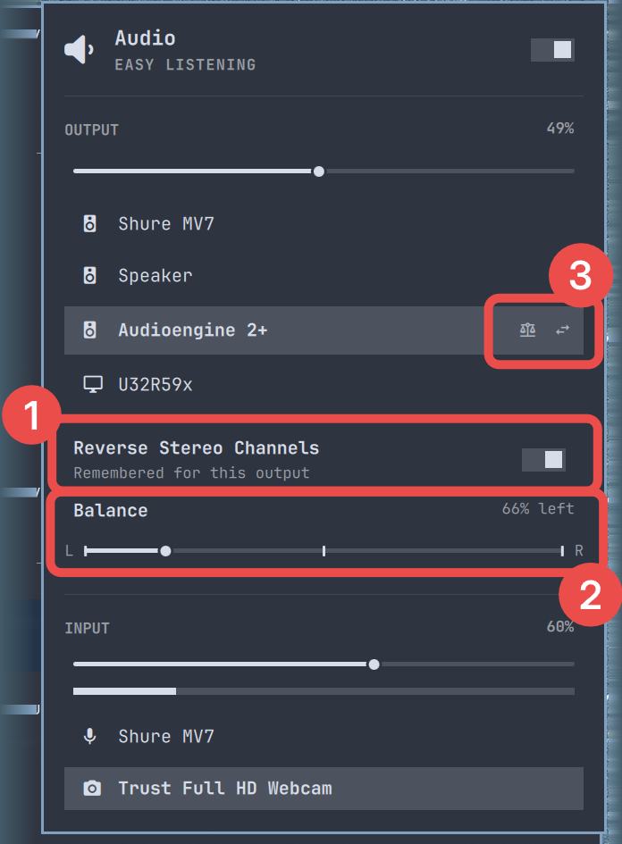

# Little Stereo

Little Stereo adds stereo reversal and balance controls to Omarchy's audio
panel. Each output device keeps its own settings, so switching between
speakers, headphones, and Bluetooth devices does not require setting them up
again.

Little Stereo is named after the Song Little Stereo by the Swedish band Teddybears!



## What the screenshot shows

1. **Reverse stereo** — Turn on **Reverse Stereo Channels** when your left and
   right speakers are physically arranged the other way around. It also works
   with Bluetooth outputs.
2. **Balance** — Move the balance slider toward the audible left or right side.
   The selected master volume stays stable, including when stereo is reversed.
3. **Memory and status per output** — Little Stereo remembers reversal and
   balance separately for every output device. Icons beside an output show its
   saved state at a glance: the swap arrows indicate reversed channels and the
   balance scales indicate an adjusted balance.

Select an output to view or change its settings. When you return to that
device, Little Stereo restores them automatically.

## Install

```bash
omarchy plugin add https://github.com/erikabel/little-stereo --enable --yes
omarchy plugin disable omarchy.audio
```

Little Stereo replaces the built-in audio bar widget, so the built-in
`omarchy.audio` widget should be disabled while Little Stereo is enabled.

## Remove

Reset Little Stereo's saved settings and generated WirePlumber configuration
before removing the plugin:

```bash
~/.config/omarchy/plugins/io.github.erikabel.little-stereo/scripts/little-stereo cleanup
omarchy plugin remove io.github.erikabel.little-stereo
omarchy plugin enable omarchy.audio
```

The cleanup command restarts WirePlumber and the Omarchy shell so the normal
audio path is restored immediately.

## How it works

Settings are saved under `~/.config/omarchy/audio`. Stereo reversal is applied
with a generated WirePlumber filter rule, upstream of the selected physical or
Bluetooth output. Balance uses per-channel PipeWire volume while preserving the
chosen master level.

This project is based on Omarchy's built-in Audio plugin and is distributed
under the MIT License.
